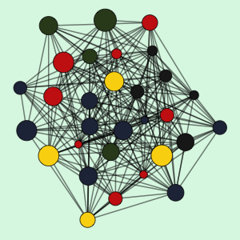

```{r setup, include = FALSE, warning = FALSE, message = FALSE}

#     remotes::install_github("mitchelloharawild/icons")

#Load the good stuff
library(tidyverse)
library(pagedown)
library(icons)
library(knitr)
library(ggthemes)
library(fontawesome)

#Token

#Working directory for .RMD
knitr::opts_knit$set(echo = TRUE,
                     root.dir = rprojroot::find_rstudio_root_file())

#Controlling figure output in markdown
knitr::opts_chunk$set(
#  fig.height =   
  fig.width = 6,
#  fig.asp = .5,
#  out.width = "90%",
#  out.height = 
 fig.align = "center",
  cache = FALSE
)

#Set Theme for ggplot2
theme_set(theme_bw() + theme(plot.title = element_text(hjust = 0.5), legend.position = "bottom"))

#Set Scientific notation output for knitr
options(scipen = 999)

knitr::opts_chunk$set(echo = F, message = F, warning = F, fig.pos = "!H", fig.height=4, fig.width=7, fig.align='center')
options(scipen=999)


# older more saturated color: #A2E4B8

sidebar_color <- '#dcf7e5' # make sure that this color mathces 'sidebar-background-color' in the CSS file
font_color <- '#36454f'

```

Aside
====================================

```{r create a plot for top corner, echo = FALSE, message=FALSE, warning=FALSE, include=FALSE}


library(igraph)
library(wesanderson)

set.seed(123)  # set the seed for reproducibility

# Create the graph with 30 nodes
g <- sample_gnp(30, 0.5)

# Get the 'Royal2' color palette
colors <- wes_palette("BottleRocket2")

# Assign a color to each node randomly
V(g)$color <- colors[sample(1:length(colors), vcount(g), replace = TRUE)]

# Assign a size to each node randomly
V(g)$size <- runif(vcount(g), 10, 30)

png("./myplot.png",  width=300, height=300)
    
    # Plot the graph
    par(bg = sidebar_color , mar=c(0,0,0,0)+.01)
    plot(g, vertex.color = V(g)$color, 
         vertex.size = V(g)$size * .75, 
         vertex.label = NA,
         edge.color = adjustcolor("black", alpha = .5), 
         edge.size = 1000, 
         edge.width = 2, 
         bg = sidebar_color)

dev.off()

```

```{r echo = FALSE, out.width = "100%"}
 
```
Contact Info
------------------------------------  

- <i class="fa fa-tablet-alt"></i> [Gmail](mailto:denisostroushko1@gmail.com)
- <i class="fa fa-linkedin-square"></i> [LinkedIn](https://www.linkedin.com/in/denis-ostroushko/)
- <i class="fa fa-sync"></i> [Website](https://PASTE MY LINK)
- <i class="fa fa-github"></i> [Github](https://github.com/denisostroushko1)

Technical Skills 
------------------------------------  

```{r}

build_skill_bars <- function(skill_data, section_title) {
  skill_data %>%   # take in the data that says what software I use and what rating I give it
    filter(section == section_title) %>% # seelct only tech skills 
                                          # for now this is an irrelevant filter since all I included were tech skills  
    
    ggplot(aes(x= reorder(skill, level), y = 5)) + # start makjng rhe plot 
    
      geom_col(fill = sidebar_color) + # use columns, which will turn into the cards 
    
      geom_col(aes(x= reorder(skill, level), y = level), fill = "darkgrey") + 
     
      coord_flip() + # turn vertical bars into horizontal bars 
    
      geom_text(aes(label = skill,  y = 0.25), hjust = 0, size = 12, color = 'black') + # text that overlays software name over the bar 
    
      expand_limits(y = c(0,max(skill_data[skill_data$section == section_title,]$level))) + # make it so that the best skill is the biggest bar that occupies the entere width
    
      labs(x = NULL,
           y = NULL) + # no names or anything, we only want the bars 
      
      theme_void() + # the most minimal theme possible 
      
      theme(
        panel.background = element_rect(fill = sidebar_color, colour = NA), # fill the background with color of choice and remove the balck outline 
        plot.background  = element_rect(fill = sidebar_color, colour = NA) # same here 
      ) 
}

```


```{r}

# some person make an example from Nick's resume; will ustilize this example to crete skill bars 
# https://www.mattleary.com/blog/2020-01-04-pagedown_resume/

resume_data <- 
  data.frame(
    rbind(
      c("Tech", "R/Rstudio", 5),
      c("Tech", "SAS/SQL", 4),
      c("Tech", "Git", 3),
      c("Tech", "Python", 2),
      c("Tech", "AWS S3", 2)
    )
  ) # this data set is simply the 'data' for the bars that will show my skills
    # actual score does not matter, as far as I udnerstand from testing differnet values 
    # what matters is the relevant score of each given skill to the max score defined in the data 

colnames(resume_data) <- c("section", "skill", "level")

resume_data$level <- as.numeric(resume_data$level)

# use function from a previous plot to create a ggplot that actually creates a 'plot' under the picture 
build_skill_bars(
  skill_data = resume_data, 
  section_title = "Tech"
  )

```

Analytical Skills
------------------------------------

* Statistical Modeling and Inference 
* Causal Inference 
* Predictive Modeling 
* Non-parametric Methods 
* Evaluation of Estimators and Bias-Variance

Data Sceince 
------------------------------------

* Static Flexdashboards 
* Interactive ShinyApps 
* `ggplot` visualizations  
* Source data-to-report pipelines  
* Big Claims and Insurance Data

$~$  
*Document powered by* `pagedown`
Source code in [Git](https://github.com/denisostroushko1/pagedown_resume) 

Last updated on `r format(Sys.Date(), "%m/%d/%Y")`

Main
====================================

Denis Ostroushko {#title}
------------------------------------

<!-- if a resume needs a header than include it here --> 

Education {data-icon=graduation-cap}
------------------------------------

### University of Minnesota  
<!--bullet point  is above --> 
**MS Biostatistics** 3.815 GPA  <!-- first entry, major and degree in bold. THIS IS A Subtitle--> 

Minneapolis, MN <!-- second position is always a location --> 
 
Expected  2024 - 2022  <!-- dates have to be listed as Newer - Older in the pagedown format --> 

<!-- This is the body of a bullet point pretty much --> 
<!-- we can leave this open --> 
### University of Minnesota - Morris 

**BA Mathematics, Statistics** 3.43 GPA

Morris, MN 

2019 - 2015 


Selected Experience {data-icon=suitcase} 
------------------------------------

### Healthcare Analyst II 

**Medica**

Minneapolis, MN 

Present - 2021 <!-- Date new to date old --> 

<!-- now use a list of bullet points to decribe achievements --> 
- Collaborated with business owners to evaluate and improve programs assisting members. Used statistical
models and simulations to understand variance of cost savings estimates. Collaboratively developed a strategy 
to generate additional $1,000,000 annualized savings. 
- Translated actuarial completion factors from spreadsheets to SAS code for automation purposes. Reduced delivery time 
of monthly completion factors from a few days to a few hours. Implemented a more granular way to estimate these factors, 
resulting in 35% prediction error reduction. 
- Collaborated with member identification team to develop a predictive model for members at risk of a 30-day hospital 
readmission. Collectively improved AUC score from 0.72 to 0.79. 

### Healthcare Analyst I 

**Medica** 

Minneapolis, MN 

2021 - 2019 

- Refactored legacy SAS and SQL pipeline for monthly large data set processing. Reduced total tun time by 60%. Introduced  QA checks. <!-- make sure there is no empty line between bullet points so that they render properly in the document --> 
- Produced static and interactive dashboards to visualize and summarize healthcare cost and utilization data for physician services and nursing teams. Automated reports saved 10 hours of manual editing each month.
- Lead the effort to introduce metrics from Milliman proprietary software. New metrics were used for cost savings opportunity identification and lead to more active business units engagement. 

### Research Assistant
<!-- make a hyperlink for the truckers and turnover research project --> 
[Truckers & Turnover Research Project](https://morris.umn.edu/academics/truckers-turnover-research-project)

Morris, MN 

2019 - 2018

- Managed scripts to produce publication materials. Presented results of medical cost analysis for truck drivers with OSA as a poster. Helped develop a bootstrap simulation to estimate variance of cost difference. 

<!-- 
Communication Experience {data-icon=book}
------------------------------------

### Publications `r fa("align-left", fill = "#20C073")` and Software `r fa("r-project", fill = "steelblue")`

N/A

N/A <!-- adding N/A removes location sign, which is pretty cool --> 

<!--
Present - 2020

- ["ShinyApp - Market Analysis.(2021)"](https://coingalaxy.shinyapps.io/super_secret_db/)
- ["The Pre-Registry Commercial Driver Medical Examination: Screening Sensitivity and Certification Lengths for Two Safety-Related Medical Conditions.(2019)"](https://pubmed.ncbi.nlm.nih.gov/31977920/)

--> 

